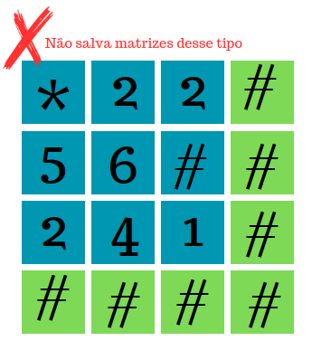
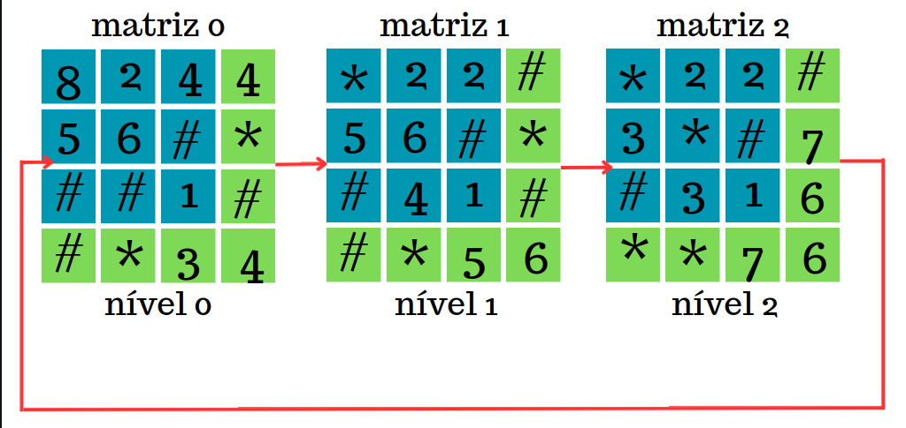
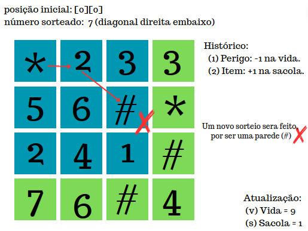
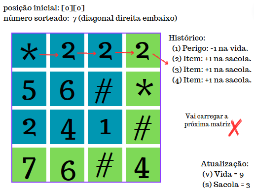
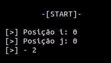
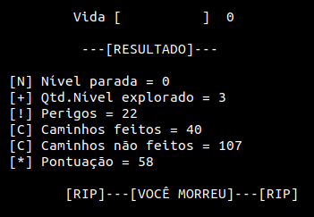

# AEDS: Labirinto Recorrente

A pedido do professor de Algoritmos e Estruturas de Dados do CEFET - Divinópolis, foi feito um algoritmo em C++, que de forma aleatória ande por N matrizes e como saída informa os quantidade de perigos enfrentados, quantas posições que foram
e não foram visitadas e quantos itens consumidos durante o percurso.

# Objetivos

Esse algoritmo tem como objetivo pegar N matrizes quadradas do tamanho TxT e salvá-las como N níveis do jogo. A partir da primeira matriz (1 Nível) se inicia o percurso em uma determinada posição, e enquanto tiver vida no jogo ou o percurso percorrido for diferente de zero (itens para consumir) o programa será executado. No final o algoritmo retorna quantos(as) perigos, casas exploradas e não exploradas, e também a quantidade de itens consumidos.

# Condições Especiais do Algoritmo

 <ul>
   <li> Criar um sistema que leia N matrizes quadradas no tamanho TxT.</li>
   <li> Iniciar a vida do jogo com 10.</li>
   <li> Enumerar as matrizes, de forma a deixá-las organizadas para processamento (separando-as como níveis para o jogo). </li>
   <li> Partindo da primeira matriz, você deve iniciar de um ponto, esse deve ser fornecido pelo usuário. Não é permitido definir diretamente no código.</li>
   <li> A partir da primeira matriz, você tem como regras: (a) Não andar na parede, cuja representação é o #; (b) andar uma posição por vez; (c) No final da matriz caso o próximo passo seja andar para posições "inexistente" carregar novo nível (matriz) e caso seja a última matriz reiniciar desde da primeira novamente; (d) Caso posição seja '*' subtrair -1 da vida; (e) Caso posição seja um número, subtraia -1 desse número e coloque +1 na sacola; (f) Toda vez que sacola chegar a ter valor 4, zerar ela e adicionar +1 na vida. </li>
   <li> Caminhar de forma randomicamente, caso posição seja # gerar novas posições até andar.</li>
   <li> Ao alcançar a última linha ou a última coluna da matriz, e a próxima posição for além dos limites da matriz, carregar novo nível (matriz).</li>
   <li> Novos níveis sempre serão iniciados na posição que o usuário informou inicialmente, e caso for #, o programa gera uma nova posição inicial apenas para aquele nível.</li>
   <li> O caminhamento continua até todas as posições andadas tiverem valor zero e enquanto a vida do jogo for maior que zero.</li>
   <li> Informar no final do programa: número de perigos enfrentados, quantidade de posições que foram ou não exploradas e quantidade de itens consumidos.</li>
 </ul>

## Especificações do Arquivo de Entrada

   <ul>
      <li>1 - A primeira linha deve ser destinada a dizer o tamanho das matrizes e a quantidade de matrizes presente no arquivo, todos esse números separador por uma tecla de espaço ' '. </li>
      <li>2 - Como já citado as matrizes tem que ser quadráticas.</li>
      <li>3 - Cada matriz deve ser separada por uma linha vazia entre elas.</li>
      <li>4 - Os números de cada posição devem ser separado por um espaço que define a troca de coluna da matriz.</li>
      <li>5 - Para trocar a linha da matriz deve passar para próxima linha do arquivo.</li>
   </ul>

# Lógica

<li align="justify"> Primeiramente faz-se a leitura de todas as matrizes do arquivo input.data e separa cada uma em um arquivo definindo seu número nível de acordo com a ordem cronológica no arquivo. Caso dentro do input.data tenha alguma matriz que tenha a linha e a coluna inteira apenas com parede, essa matriz é descartada (não é salva) por ser um nível sem saída/portal, tornando ela inviável para o jogo.</li>

<ul>
   <li>Exemplicando: </li>
   

      
   

</ul>

   <strong>Com a matriz inicialmente na posição [x][y] cujo informada inicialmente pelo usuário.</strong>
   <strong>
      <ul>
         <li>[#] = parede.</li>
         <li>[*] = perigo.</li>
         <li>[0-9] = itens de consumo.</li>
      </ul>
   </strong>

   <li>  Se recebe como entrada (informada pelo usuario) a posição [x][y] inicial e verifica se a posição [x][y] é diferente de parede (#). Caso sim será analisado se é um perigo ou item de consumo. Caso for (#) será sorteado uma nova posição [x][y] que seja diferente de parede.</li>

   <li> Após a posição inicial ser definida, faz as análises do jogo (se estiver no perigo subtrai -1 da vida, caso estiver em itens de consumo soma na sacola).</li>

   <li> Em seguida faz o sorteio de um número entre 1 - 8, que define as coordenadas para o caminhamento. Cada número significa:</li>

<ul>

1 - Direita; 

2 - Esquerda;

3 - Baixo;

4 - Cima;

5 - Diagonal Direita em cima;

6 - Diagonal Esquerda em cima;

7 - Diagonal Direita embaixo;

8 - Diagonal Esquerda embaixo;

</ul>

<li align="justify"> Feito sorteio verifica se a posição é diferente de (#) e se é uma posição permitida para caminhar. Veja abaixo as regras de validação se é uma posição possível:</li>

<ul>
<li>1 - Direita: valor de [y] tem que ser menor que o tamanho da matriz -1;</li>
<li>2 - Esquerda: valor de [y] tem que ser maior que zero;</li>
<li>3 - Baixo: valor de [x] menor que o tamanho da matriz;</li>
<li>4 - Cima: valor de [x] maior que zero;</li>
<li>5 - Diagonal Direita em cima: valor de [x] maior que zero e o valor de [y] tem que ser menor que o tamanho da matriz -1; </li>
<li>6 - Diagonal Esquerda em cima: valor de [x] maior que zero e o valor de [y] tem que ser maior que zero</li>
<li>7 - Diagonal Direita embaixo: valor de [x] e [y] tem que ser menor que o tamanho da matriz -1</li>
<li>8 - Diagonal Esquerda embaixo: valor de [x] e [y] tem que ser maior que zero;</li>
</ul>

   <li> Caso o número sorteado atender as regras de caminhamento é feito os incrementos nos valores [x][y], faz as análises se é perigo ou um item de consumo, em seguida atualiza o valor da sacola e da vida, e salva se a coordenada [x][y] caso ela nunca tenha sido andada. Caso não, é sorteado um novo número.</li>

   <li> Quando chegar na última linha da matriz, e número de sorteio for 3,7 ou 8, o programa pula para o próximo nível/matriz, devido ao fato das posições sorteadas irem além da matriz de tamanho T.</li>

   <li> No caso de chegar na última coluna da matriz, e número de sorteio for 1,5 ou 7, o programa pula para o próximo nível/matriz, devido ao fato das posições sorteadas irem além da matriz de tamanho T.</li>

   <li> Em outras situações apenas é gerado um novo número de sorteio.</li>

   <li> Se estiver no último nível/matriz e ainda tiver vida e as coordenadas que foram andadas tiverem valor maior que zero , ser reinicia no primeiro nível novamente.</li>

<ul>
   <li>Exemplicando: </li>
   

      
   

</ul>

<li align="justify"> Toda essa lógica sera executada enquanto as posições andadas tiverem valor diferente de zero ou até a vida chegar a zero.</li>

<li align="justify"> Caso especial: Se a posição de entrada inicial informada pelo usuário não permite o caminhamento (só tem parede ao redor da posição [x][y]) é gerado uma nova posição automaticamente que antenda a continuação do caminhamento. </li>

<li align="justify"> Ao finalizar o jogo, todos os arquivos dos níveis são apagados e salvos em apenas um arquivo denominado output.data.</li>

# Exemplos

<li> Se posição sorteada for parede </li> 

   

<li> Se posição sorteada for além da matriz e a posição atual estiver nas zonas de portais </li> 

   

<li> Ou seja, se o número de sorteio fosse para esquerda, não iria acontecer a troca de matriz.</li>

# Arquivos e Funções

* `input.data`: arquivo onde as matrizes que serão processadas estão salvas.
* `main.cpp`: arquivo responsável por criar um objeto da Classe Jogo, de inicializar a alocação dinâmica da matriz, pegar o tamanho das matrizes (através de uma função `int lerTamanhoMatriz()`) e passar como parâmetro para a função `.lerTodasMatrizes(matriz,tamanho);`.
* `matriz.hpp`: arquivo onde estão declaradas todas as funções que serão usadas no arquivo `matriz.cpp`, como também a Classe jogo e uma struct que armazena as posições andadas de cada matriz.
* `matriz.cpp` : arquivo que estão as funções que serão explicadas abaixo.

## Funções

   <li align="justify">

   * `int lerTamanhoMatriz()`: ela abre o arquivo input.data e percorre para ler o tamanho das matrizes, essa função transforma para o tipo int a string que esta especificando o tamanho da matriz. No final fecha o arquivo e retorna o valor;

   * `void lerTodasMatrizes(string** matriz, int tamanho)`: primeiramente ela inicializa a matriz dinamicamente (com !) através da função `iniciarMatriz(int** matriz, int tamanho)`, logo ela abre o arquivo para ler a primeira linha e começa a ler as matrizes, lendo cada caractere até o espaço e salvando na matriz criada dinamicamente. Dentro dessa mesma função é chamada outra, a `verificador_Nivel_SemPortal(string** matriz, int tamanho, int &f)` assim que a última linha e coluna for diferente de !, e em seguida inicia o jogo com a função `iniciarJogo(matriz,tamanho,0,qtdMatriz)`;

   * `void verificador_Nivel_SemPortal(string** matriz, int tamanho, int &f)`: essa função verifica se aquela matriz atende os critérios de possuir pelo menos um portal. Caso sim, chamasse a função `void salvarMatrizArq(matriz,tamanho,f)` e incrementa o número de nível;

   * `void salvarMatrizArq(matriz,tamanho,f)`: essa função salva cada matriz em um arquivo .data separado e numerado (1 a N matrizes);

   * `void  void iniciarJogo(string** matriz, int tamanho, int numeroNivel,int qtdMatriz)`: nessa função abre a matriz 1.data (que foi salva pelo programa) e criar um vetor de coordenadas (onde vai ser salvo as posições distintas que foram andadas atraves de vector da struct). Essa função também é responsável de receber a posição inicial do jogo, caso posição informada não atender ao critério (diferente de # ou que a seu redor não possua apenas paredes) o programa gera uma nova posição automaticamente. Ademais chama a função `atualizandoJogo(matriz,i,j)` e salva a posição inicial no vetor de coordenadas.Por fim inicia a função `iniciarCorrida(parametros...)`;

   * `bool posicao_Bloqueada(string** matriz, int tamanho,int i, int j)`: ela é responsavel por analisar se as posições ao redor não são todas paredes, caso isso acontece o personagem está preso;

   * `void atualizandoJogo(string** matriz, int &i, int &j)`: essa função tem como objetivo olhar o valor da posição atual e fazer as devidas alterações, caso for um valor entre 1-9 de diminuir o valor da posição e aumentar +1 na sacola ou em caso de perigo subtrair -1 na vida;

   * `void iniciarCorrida(parametros...)`: aqui se faz o sorteio da coordenada da proxima posição, caso a Vida tenha valor maior que 0 ou enquanto todos os valores de todas as coordenadas percorridas forem maior que zero, isso é analisado através da função `contador_Total_CaminhoZero(parametros...)`. Caso a posição esteja na última linha ou coluna verifique se o número sorteado é um caminho possível e caso não chamasse a função ` verificadorPortal(parametros...)`. Nos outros casos que não se encontram na última linha ou coluna, inicia a  função `andar_dpsSorteio(parametros...)`. Ademais, caso a Vida seja igual a 0 entra na função `endgame(parametros...)`;

   * `void contador_Total_CaminhoZero(parametros...)`: ela é responsável por analisar se em todos os niveis as coordenadas já explorada possui valor igual a zero;

   * `void verificadorPortal(parametros...)`: essa função é a responsável de atualizar o nível para a próxima matriz e caso esteja no último nível reiniciar desde da primeira matriz novamente. Em caso à posição inicial que o usuário passou for (#) ele vai gerar uma posição randomicamente para aquele nível específico. Inicialmente essa função chama a `conferir_CaminhoZero(parametros...)` que apenas confere se as posições já andadas tem valor igual a zero antes de mudar a matriz/nível;

   * `void andar_dpsSorteio(parametros...)`: essa função recebe o número de sorteio por parâmetro e de acordo com seu valor ela analisa se a posição é possível (diferente de # e coordenada existente) dentro de cada função específica (direita,esquerda,baixo, cima, e todas as diagonais). Ademais faz o incremento das coordenadas, atualiza o jogo através da função `atualizandoJogo(parametros...)` e salva a coordenada através da função `salvar_coordenada(parametros...)`;

   * `void salvar_coordenada(parametros...)`: nessa função confere se a coordenada passada já se encontra no vetor de coordenadas, caso sim ele não adicionado, caso contrário é uma nova posição andada;

   * `void endgame(parametros...)`: função responsável por fazer a soma das posições que foram e não foram andadas, informar como saída esses valores, mais a quantidade de perigos, itens consumidos (pontuação) e quantos níveis foram inicializado;
   </li>

   * `void salvar_output(string** matriz, int tamanho, int qtdMatriz)`: ela apaga todos os arquivos de cada matriz/nivel que foram ou não andadas e salva elas (com as alterações) em apenas um arquivo chamado output.data;

## Especificação das zonas na função `void iniciarCorrida(parametros...)` que ativam os portais;

   

<ul>
<li>Região Verde: portais (responsável pela troca de nível/matriz)</li>
<li>Região Azul: região sem portal.</li>
</ul>

# Entrada

<li> Onde a os dois primeiros [>] é a coordenada inicial dada pelo usuário e o ultimo [>] o valor da posição digitada. </li> 

   

# Saída

   

<ul>
   <li> Vida: quantidade de vida que restou no jogo.</li> 
   <li> Nível parada: matriz que estava aberta quando o jogo finalizou.</li> 
   <li> Qtd. Nível explorado: quantidade de matrizes distintas que foram utilizadas.</li> 
   <li> Perigos: quantidade de perigo (*) enfrentado durante todo o jogo.</li> 
   <li> Caminhos feitos: quantidade de posições distintas feitas em todos os níveis.</li>
   <li> Caminhos não feitos: quantidade de posições distintas que não foram feitas em todos os níveis.</li>  
   <li> Pontuação: quantidade de itens (1-9) consumida durante todo jogo.</li> 
   <li> Logo abaixo fala se você morreu ou ganhou.</li> 
</ul>

# Conclusão

   Ao final do programa pode concluir que como é feito sorteios randômicos dentro do programa não é possível saber com exatidão o custo computacional. Além disso, vemos que a probabilidade do personagem conseguir concluir o caminho total (vencer o jogo) são bem baixas, devido ao fato de cada vez que o personagem tenta zerar a posição que já foi andada é muito provável que ele vai explorar uma nova (devido ao randômico), a qual também deverá ser zerada. Ademais tem os perigos que acabam tirando a vida do personagem e como o número de itens tende a diminuir cada vez mais, a morte é sempre iminente. Logo na sua grande maioria o personagem vai morrer e o programa vai dar como saída as informações citadas no tópico acima.

# Compilação e Execução

Esse pequeno exemplo possui um arquivo Makefile que realiza todo o procedimento de compilação e execução. Para tanto, temos as seguintes diretrizes de execução:

| Comando                |  Função                                                                                           |                    
| -----------------------| ------------------------------------------------------------------------------------------------- |
|  `make clean`          | Apaga a última compilação realizada contida na pasta build                                        |
|  `make`                | Executa a compilação do programa utilizando o gcc, e o resultado vai para a pasta build           |
|  `make run`            | Executa o programa da pasta build após a realização da compilação                                 |

# Contatos
<a>
✉️ <i>lucaslimadeoliveira80@gmail.com</i>
</a>